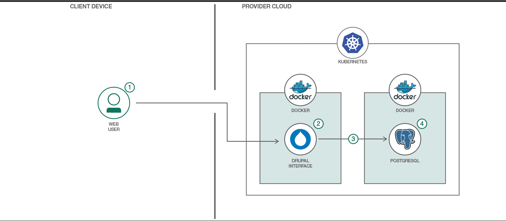

## Deploy Drupal on Kubernetes

* Configure an app running multiple containers in Kubernetes
* Run a website hosted via Kubernetes
* Use Kubernetes persistent volumes to maintain Drupal configurations between container restarts



## Flow

1. User interacts with the Drupal web interface.
2. The Drupal container uses its persistent volume to store website data (but not content).
3. Drupal container connects to PostgreSQL container to access website content.
4. PostgreSQL container uses its persistent volume to store the database contents.

## Steps

Follow these steps to run Drupal on GKE Kubernetes.

1. Enable GKE service on your project:
```
gcloud services enable container.googleapis.com
```

2. Create GKE cluster:
```
gcloud container --project heisenberglabs \
clusters create heisenberglabs \
--machine-type n1-standard-2 \
--image-type "COS" --disk-size "10" \
--num-nodes 3 --network default \
--enable-cloud-logging --no-enable-cloud-monitoring
```

3. Create serice and deployment:
```
./scripts/quickstart.sh
```

4. Access drupal application:
```
kubectl get svc
```
   Get EXTERNAL-IP from the LoadBalancer service and open it in browser

#### Some userful kubectl commands:
```
kubectl get nodes -o wide # --all-namespaces
kubectl get all
kubectl get pods
kubectl get svc
kubectl get deployment


kubectl scale deployment <app-name> --replicas=3

kubectl delete service <service-name>
gcloud compute forwarding-rules list
```
